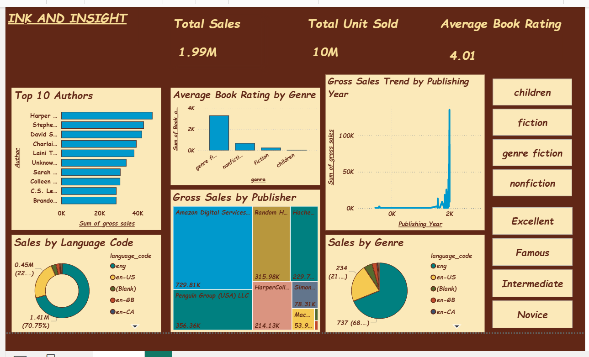

# Ink and Insight: A Bookshop Sales Analysis

## Project Overview

This project is an end-to-end data analytics pipeline that analyzes sales data from a bookstore. The primary goals were to perform exploratory data analysis (EDA) to uncover sales trends, build a predictive model to forecast future sales, and present the key findings in an interactive Power BI dashboard.

---

## Data Source

The dataset used for this project was the "Books Sales and Ratings" dataset, publicly available on Kaggle.
[Link to Dataset](https://www.kaggle.com/datasets/thedevastator/books-sales-and-ratings)

---

## Tools Used

- **Database:** PostgreSQL
- **Analysis & Modeling:** Python (Libraries: Pandas, Scikit-learn, SQLAlchemy, Matplotlib/Seaborn)
- **Visualization:** Power BI
- **Version Control:** Git & GitHub

---

## Project Walkthrough

1.  **Data Storage & Cleaning:** The raw CSV data was first loaded into a PostgreSQL database. In Python, the data was loaded into a Pandas DataFrame, where column names were cleaned and standardized for easier analysis.

2.  **Exploratory Data Analysis (EDA):** I used SQL for initial data exploration and Python (Matplotlib/Seaborn) for detailed visualization to answer key business questions:
    -   Which genres and publishers generate the most revenue?
    -   What is the relationship between book ratings, price, and sales?
    -   Are there noticeable sales trends over the years?

3.  **Predictive Modeling:**
    -   Two machine learning models were trained using Scikit-learn.
    -   **Model 1:** Predicts the `units_sold` for a new book with a Mean Absolute Error of **$165.52 units**.
    -   **Model 2:** Predicts the `gross_sales` (revenue) for a new book.
    -   Feature importance analysis revealed that `book_average_rating` and `sales_rank` were the most influential factors in predicting sales.

---

## Dashboard Showcase: Ink and Insight

An interactive dashboard was created in Power BI to summarize the findings. The dashboard features KPIs, genre and publisher performance, and sales trends over time, all presented with a custom "vintage bookshop" theme.

